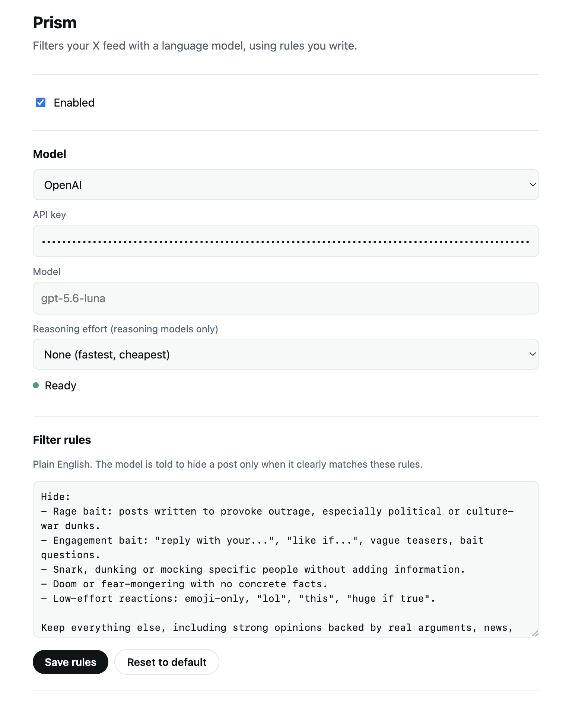
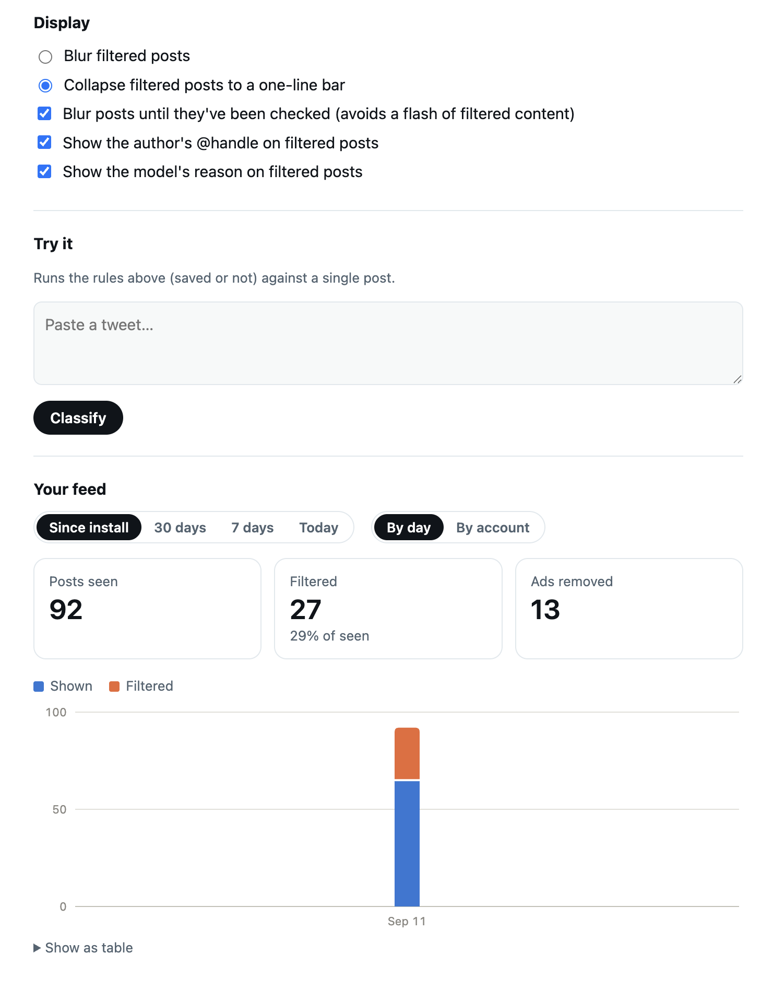

# Prism

A Chrome extension that filters your X feed with a language model, using rules
you write in plain English. It also removes ads and shows usage statistics.

The default backend is Chrome's built-in Gemini Nano, which runs entirely on your device.
OpenAI and Anthropic models are optional, with your own API key.

<p>
  
  
</p>

## Install

No build step. Requires Chrome 138+.

1. Clone this repo.
2. Open `chrome://extensions`, enable **Developer mode**, click **Load unpacked**, and select the repo folder.
3. Click the Prism toolbar icon to open its settings:
   - **Model**: Chrome built-in (click **Download model** the first time; a few GB, and Chrome
     wants ~22 GB free disk), or OpenAI / Anthropic with an API key.
   - **Filter rules**: what to hide. **Try it** tests the rules against a single post.
4. Open x.com. Filtered posts are blurred (or collapsed) with a "Filtered" label; click one to
   show it. Options can add the author's @handle and the model's reason to the label.
   The toolbar badge counts filtered posts in the tab, or shows `!` if the model failed.

## Privacy

- There is no server, analytics or telemetry.
- Settings, API keys, the verdict cache and stats live in `chrome.storage.local` on your machine.
- With Chrome built-in, nothing leaves your device. With OpenAI or Anthropic, posts on your
  screen, plus the ones your timeline has already loaded just ahead of you, are sent to that
  provider (handle, text and quoted text only) for classification.

## How it works

```
x.com page                                   extension
─────────────────────────────                ─────────────────────────────────────────
intercept.js (MAIN world)                    background.js (service worker)
  hooks XHR/fetch, pulls tweets out of         queue, batching, verdict cache,
  X's GraphQL responses  ── postMessage ─┐     badge; routes to the provider
                                         │          │
content.js (isolated world)  ◀───────────┘          │ runsIn: 'offscreen'
  finds <article>s, asks for verdicts  ── runtime ──┤
  (on-screen first), applies blur/collapse ◀── msg ─┤
                                                    ▼
                                             offscreen.js hosts providers that need a
                                             window context (LanguageModel isn't exposed
                                             in extension service workers)
```

- **Tweet data** is captured from X's own API responses. Timelines (home, lists, profiles,
  threads) are classified ahead of time, so verdicts are usually ready before you scroll to
  them; anything else is classified once it's on screen. Tweets not seen on the network fall
  back to DOM scraping.
- **Ads** (promoted tweets) are always removed from the timeline, without a model call.
- **Fail open**: errors show the tweet. Rate limits and other transient errors are retried a
  couple of times first, with a small spinner on the post while it waits. Media-only tweets
  are never filtered.
- **Cache**: verdicts are cached by tweet id; changing the rules or model clears the cache.
- **Stats** (settings page → *Your feed*): posts seen per day (any part on screen, counted
  once per day), how many were filtered, ads removed, and a per-account breakdown.


## License

[MIT](LICENSE)
